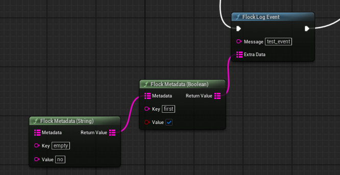

# Analytics

Session tracking, diagnostic logging, automatic exception capture, and an offline queue that survives a
crash. Everything below is off when **Analytics Enabled** is unticked in
*Project Settings → Plugins → Flock SDK*.

## Blueprint

The nodes live under *Flock | Analytics* and **none of them needs the subsystem wired in** — they resolve
it from the calling graph: `Flock Log Event`, `Flock Log Error`, `Flock Log Exception`,
`Flock Record Screen View`, `Flock Set Analytics Consent`, `Flock Flush Analytics`, plus the session
nodes. All are safe no-ops before the SDK has initialized.



Build the **Extra Data** map by dragging off that pin — the same builders the C++ side uses appear as
chainable nodes: *Flock Metadata (Integer)*, *(Float)*, *(Boolean)*, *(String)*. Add one per field and
chain them:

```
Flock Metadata (Integer) "level" 3 → Flock Metadata (Boolean) "flawless" true → Extra Data
```

**The first node needs nothing wired into its own Metadata pin** — leaving it empty starts a fresh map.

## C++

```cpp
UFlockSubsystem* Sdk = UFlockSubsystem::Get(this);

Sdk->LogAnalyticsEvent(TEXT("level_complete"),
    FFlockMetadata().Add(TEXT("level"), 3).Add(TEXT("deaths"), 0).Add(TEXT("flawless"), true));

FFlockLogDetails Details;
Details.LogicalExpression = TEXT("ItemCount >= 0");
Details.ErrorCode = TEXT("INV_DESYNC");
Sdk->LogAnalyticsError(TEXT("Inventory desynced"), Details);

Sdk->LogAnalyticsException(TEXT("Save failed"));   // callstack captured for you
Sdk->RecordAnalyticsScreenView(TEXT("MainMenu"));
```

`FFlockMetadata` builds the string map the wire wants without an `FString::FromInt` at every call site —
it takes ints, floats and bools directly and converts implicitly.

## Things worth knowing

**Logging.** `LogAnalyticsEvent` records a diagnostic, `LogAnalyticsError` a recoverable logic fault,
and `LogAnalyticsException` an exception. All three return immediately: the entry is written to disk
and delivered later, so a call is cheap and nothing is lost to a crash or a dead network. Keys in
your metadata reach the backend exactly as you write them.

`FFlockMetadata` builds the string map the wire wants without an `FString::FromInt` at every call
site — it takes ints, floats and bools directly and converts implicitly, so it drops into any call
taking metadata.

**Metadata builder note:** the first builder node needs nothing wired into its own Metadata pin —
leaving it empty starts a fresh map,
so a single field is a single node. (*Make Flock Metadata* exists to produce an explicitly empty map;
you don't need it to begin a chain.) Each node copies the map coming in and adds its one key, so the
chain reads left to right, mixes types freely, and writes values identically to the C++ builder. Keys
are a map, so order doesn't matter — but if two nodes use the same key, the **last one wins**. Leaving
an *Extra Data* pin unconnected is fine — you get empty metadata.

On *Flock Log Error*, right-click the **Details** pin and choose **Split Struct Pin** to get Logical
Expression, Error Code, Error Data and Extra Data as separate pins.

> If a logged event never reaches the backend, check consent first: logging is **silently dropped**
> without it, and entries are spooled to disk rather than sent immediately. Call `Flock Set Analytics
> Consent (true)` once, and use `Flock Flush Analytics` to drain the spool now instead of waiting for
> the next interval.

`FFlockLogDetails` carries the optional detail on an error or exception as one named argument:
`LogicalExpression` (the invariant that failed), `ErrorCode` (yours), `ErrorData` (structured facts
about *what* was wrong) and `ExtraData` (context about *where* the player was). Leave it default when
you have nothing to add.

**You do not need a stack trace to report an exception.** Leave the trace argument off and the SDK
walks the callstack itself. Pass one only when you genuinely have something better — a script VM's
stack, say.

**Automatic exception capture.** Engine `Error` and `Fatal` log lines are reported as exceptions with
no wiring, along with hard crashes that never reach the log. Each carries the callstack from the point
of capture, with frames as `Module+0xOffset` — measured from the module base rather than the raw
address, so a frame reads the same on every run and stays symbolicatable from your build's symbols
after the fact. Function names and source lines are included when symbols are available locally.
The SDK's own categories are excluded so a failed upload cannot report itself in a loop.
Once the queue is full, further entries are dropped *before* their callstack is walked, so an error
storm stays cheap.

**Sessions** open when a player signs in and close on logout or quit, tracking duration, screen
views, pauses, and FPS. Backgrounding pauses the session; returning after **Analytics Session
Timeout** starts a fresh one. Starting a session while one is open replaces it, closing the old one
first. Bind `OnSessionStarted` / `OnSessionEnded` / `OnSessionPaused` / `OnSessionResumed` on
`GetEvents()`, or read `GetAnalyticsSnapshot()` for live metrics.

**A session end is never lost.** Every close is written to disk before it is sent, so quitting,
signing out, losing the network, or crashing outright all cost delivery time rather than the record —
whatever did not go out drains on the next flush or the next launch. Queued ends wait for a
signed-in player rather than retrying against a closed door, so a game sitting on its title screen
makes no analytics traffic at all. A run that dies with a session
open is picked up on the following launch and closed at the last moment it was known to be alive, so
a crashed session does not sit open on the backend forever. A session that could not be registered
when it started (offline at sign-in, say) registers itself when its end is finally delivered.

**Offline queue.** Entries are stored under the project's Saved directory and sent in batches on an
interval, when the app is backgrounded, or when you call Flush. A failed send keeps the batch queued
for the next attempt; the queue is capped by **Analytics Max Cached Events**, dropping oldest first.

**Crash reporting.** A run that ends without a clean quit is detected on the next launch and reported
once, classified `background_kill` (OS eviction or swipe-close) or `abnormal` (died in the
foreground), with the lost session's id, an approximate time of death, and how many unhandled
exceptions preceded it. Disabled in the editor, where stopping Play-In-Editor is not an app death.

**Consent** is a gate, not a filter. With consent withheld there is no session and nothing is
collected, not even on disk. The decision persists between runs; withdrawing it discards the session
outright — it is not reported, not queued, and no `OnSessionEnded` is raised — along with anything
already queued. Granting it opens the session that sign-in could not — so in an opt-in flow, a player
who agrees after signing in still gets a session.

```cpp
Sdk->SetAnalyticsConsent(true);            // persists; raises OnConsentChanged
const bool bOptedIn = Sdk->HasAnalyticsConsent();
Sdk->EraseLocalAnalyticsData();            // drops the queue, the decision, and any crash marker
```

Leave **Analytics Require Explicit Consent** off to collect by default (a withdrawal still applies),
or tick it for an opt-in flow where nothing is collected until you call `SetAnalyticsConsent(true)`.

> Analytics timestamps come from the device clock, so they are wrong if the player's clock is wrong.
> Session durations are unaffected — they are measured from frame deltas, not clock readings.

---

[← Back to the README](../README.md)
