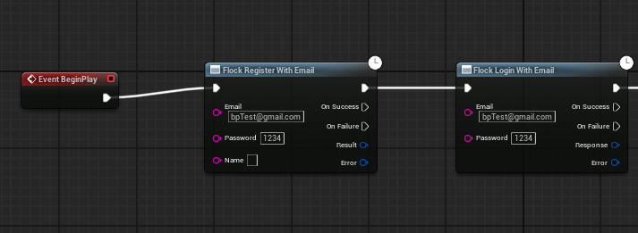

# Authentication

Sign players in with email, device id, Google, Apple, Steam, Facebook, or Discord. Tokens are stored
encrypted between launches and the session is restored automatically on startup; expired access tokens
refresh silently, including a one-shot retry for an authenticated call that raced the expiry.

## Providers at a glance

The SDK does not obtain the third-party credential for you — it takes the token your platform SDK
produced and exchanges it for a Flock session. What each provider expects:

| Provider | Credential | Where it comes from | Register? |
|---|---|---|---|
| **Email** | email + password | your own UI | ✅ |
| **Device** | a device id string | a stable id you persist (`FPlatformMisc::GetDeviceId`, or your own GUID) | ✅ |
| **Google** | an **ID token** | Google Sign-In on the platform | ✅ |
| **Apple** | an **identity token** | Sign in with Apple | ✅ |
| **Steam** | a **session ticket** | Steamworks `GetAuthSessionTicket` | ✅ |
| **Facebook** | a Facebook user id | Facebook SDK | ❌ login only |
| **Discord** | a Discord user id | Discord OAuth | ❌ login only |

**Facebook and Discord have no register call.** The backend exposes no dedicated route for them, so the
SDK posts to the generic login endpoint with the provider id. An account must already exist — there is no
`RegisterWithFacebook`, and adding one would only produce a call the server rejects.

For every other provider, **register and login are separate calls**: registering does not sign the player
in, and logging in does not create an account.

## Blueprint

Every call is an async node under *Flock | Auth*, each with `On Success` and `On Failure` execution pins
and no Target pin.

**Login:** `Flock Login With Email`, `… With Device`, `… With Google`, `… With Apple`, `… With Steam`,
`… With Facebook`, `… With Discord`.

**Register:** `Flock Register With Email`, `… With Device`, `… With Google`, `… With Apple`,
`… With Steam`.



Registering does not sign the player in — the two are separate calls, which is why both appear above.

**Session and account:** `Flock Restore Session`, `Flock Refresh Token`, `Flock Revoke Token`,
`Flock Forgot Password`, `Flock Reset Password`, `Flock Send Email Verification`, `Flock Verify Email`,
`Flock Is Name Available`.

Sign-in state needs no Target pin either — `Flock Is Authenticated`, `Flock Get Player Id`, and
`Flock Logout` resolve the SDK from the calling graph.

To react from anywhere rather than at the call site, bind `On Authenticated`, `On Logged Out`,
`On Session Restored`, and `On Auth Expired` on the [event hub](events.md).

## C++

Everything lives on the auth provider. Only the credential argument differs between providers:

```cpp
UFlockSubsystem* Sdk = UFlockSubsystem::Get(this);
FFlockAuthProvider* Auth = Sdk->GetAuthProvider();

Auth->LoginWithEmail(Email, Password, OnLogin);
Auth->LoginWithDevice(DeviceId, OnLogin);
Auth->LoginWithGoogle(GoogleIdToken, OnLogin);
Auth->LoginWithApple(AppleIdentityToken, OnLogin);
Auth->LoginWithSteam(SteamSessionTicket, OnLogin);
Auth->LoginWithFacebook(FacebookUserId, OnLogin);   // login only
Auth->LoginWithDiscord(DiscordUserId, OnLogin);     // login only
```

where the handler is the same shape for all of them:

```cpp
auto OnLogin = [](TFlockResult<FFlockPlayerLoginResponse> Result)
{
    if (Result.bSuccess)
    {
        UE_LOG(LogTemp, Log, TEXT("Signed in as %s"), *Result.Value.PlayerId);
    }
};
```

Registration takes the same credential plus an optional display name — pass an empty string to omit it:

```cpp
Auth->RegisterWithEmail(Email, Password, TEXT("Nightjar"), OnRegister);
Auth->RegisterWithDevice(DeviceId, FString(), OnRegister);   // no display name
Auth->RegisterWithGoogle(GoogleIdToken, Name, OnRegister);
Auth->RegisterWithApple(AppleIdentityToken, Name, OnRegister);
Auth->RegisterWithSteam(SteamSessionTicket, Name, OnRegister);

auto OnRegister = [](TFlockResult<FFlockRegisterResult> Result)
{
    // Not a failure — this identity already had an account. Send them to a login.
    if (Result.bSuccess && Result.Value.bAlreadyRegistered) { /* ... */ }
};
```

## Account flows

```cpp
Auth->IsNameAvailable(TEXT("Nightjar"), OnChecked);        // advisory preflight

Auth->ForgotPassword(Email, OnSent);                       // emails a reset code
Auth->ResetPassword(Email, Code, NewPassword, OnReset);

Auth->SendEmailVerification(OnSent);                       // to the signed-in player's address
Auth->VerifyEmail(Code, OnVerified);

Auth->RevokeToken(OnRevoked);                              // kill the refresh token server-side
Auth->Logout();                                            // local sign-out
```

## Account linking

A player can hold more than one credential. This is what turns a guest who started on a device into
someone who can sign back in on a new phone — they add an email or a social login, and the progress
stays on the same player.

```cpp
Auth->GetLinkedAccounts(OnListed);                         // what is attached right now

Auth->LinkEmail(Email, Password, OnLinked);
Auth->LinkDevice(DeviceId, OnLinked);
Auth->LinkGoogle(IdToken, OnLinked);                       // also Apple / Steam / Facebook / Discord

Auth->Unlink(EFlockCredentialProvider::DeviceId, OnUnlinked);
```

Every one of these answers with the player's **full updated credential list**, so a link or an unlink
doubles as a refresh — you never need a separate re-read afterwards. Each listed account carries a
typed `ProviderType` you can hand straight back to `Unlink`, plus the provider's user id, the email
where there is one, and whether that email is verified.

Blueprint gets the same nine as nodes under **Flock|Auth** (`Flock Get Linked Accounts`, `Flock Link
Email`, `Flock Unlink Account`, …). `OnAccountLinked` and `OnAccountUnlinked` fire on the events hub
with the provider that changed.

Four coded errors are worth handling in-game:

| Code | Means |
| --- | --- |
| `PlayerAccountAlreadyLinked` | That credential belongs to another player. There is no account-merge flow — this reaches your code and you decide what to tell the player. |
| `PlayerAccountNotLinked` | Nothing to unlink for that provider. |
| `PlayerCannotUnlinkLastCredential` | The server refuses to leave a player with no way back in. |
| `PlayerInvalidLinkRequest` | The request itself was rejected. |

## Session lifecycle

`TryRestoreSession` runs automatically after init, so a returning player is usually signed in before
`BeginPlay`, with an expired access token refreshed on the way.

`OnSessionRestored` is raised on **every** outcome, failure included — so it is the event to bind for
"decide which screen to show". `OnAuthenticated` fires only on success.

## Things worth knowing

- **An already-registered identity is a success, not an error.** Registering an account that exists
  completes with `bAlreadyRegistered` set, so you can route the player to a login rather than show a
  failure. It is logged at debug level for the same reason.
- **The display name is optional and server-enforced unique.** `IsNameAvailable` is a preflight, not a
  reservation — two players can both pass the check and one still lose at register time. Handle it.
- **`ForgotPassword` always reports success.** The backend never reveals whether an address has an
  account, so success means "if that address exists, a code was sent". Do not use it to test whether
  someone is registered.
- **Password reset needs an email credential.** `ResetPassword` accepts a session signed in with email
  (a restored email session counts) **or** an email credential linked during this session. A device or
  Steam session with no email attached cannot reset a password it never had. That linked-email
  knowledge is session-scoped and deliberately not persisted — after a restore the SDK does not know
  what is attached until you call `GetLinkedAccounts`.
- **`RevokeToken` is the server-side kill**, and the thing to reach for when a token is stolen — it
  invalidates the refresh token for good. Call `Logout` afterwards for a full sign-out; `Logout` alone
  only clears local state.
- **Token storage is an AES-encrypted file** under the project's Saved directory, keyed to the machine,
  user, and game. It defeats casual copying and inspection, not code running as the same user. Implement
  `IFlockTokenStore` to plug in platform keychain storage instead.
- **The email-verification routes need a bearer.** It rides along automatically when a player is signed
  in, and the server requires it — so those calls fail with a 401 when signed out.

---

[← Back to the README](../README.md)
