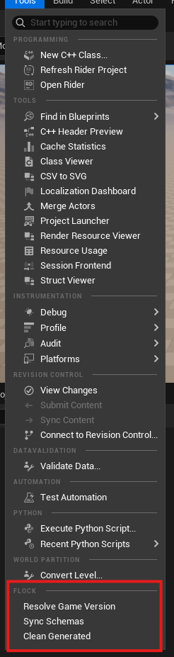
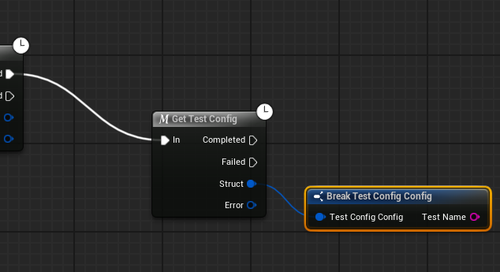
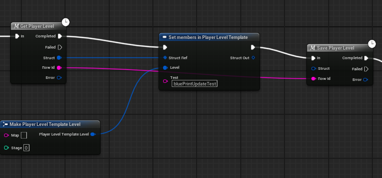
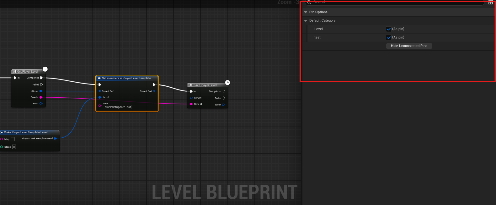
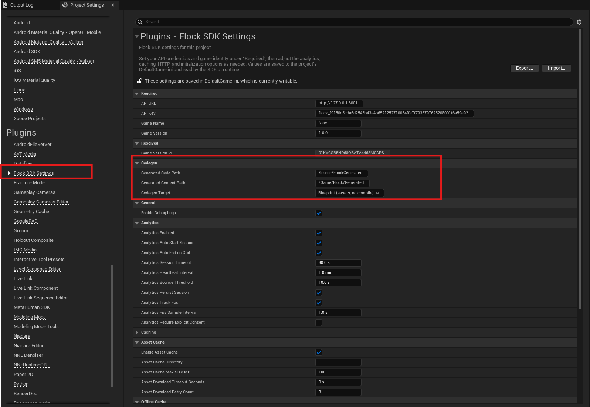

# Code generation

**Tools > Flock > Sync Schemas** fetches this game version's player templates, game configs, and shops and
generates typed assets from them, into `Content/Flock/Generated`. By default there is no C++ involved: no
toolchain, no compile, no editor restart. (`Flock.SyncSchemas` does the same from the console, and a
**Codegen Target** setting switches the whole thing to generated C++ — see below.)



What you get:

- **A struct per template and config** with real typed pins — ints, floats, strings, bools, arrays,
  string-keyed maps, and nested objects as their own structs.
- **`FlockShopItemId`, `FlockCurrencyId`, `FlockAchievementId`** — pick an item or an achievement from a
  dropdown instead of typing an id.
- **One node per config and template** — `Get Gameplay`, `Get Currencies`, `Save Currencies`. Each carries
  its own fetch and id, and answers with `Completed` / `Failed` exec pins, the typed struct, and an
  `Error`. (These are macros, so they live in event graphs; the library is parented to Actor, covering
  Actors, ActorComponents and the Level Blueprint.)
- **One node per command** — `Purchase`, `Unlock Achievement`, `Add Funds`, each taking the matching
  generated enum. `Add Funds` also bakes your `currency`-tagged template id, so it skips the lookup the
  SDK would otherwise do at runtime.
- **A function library**: each template's and config's id as a constant, `Read …` / `Make … Update`
  conversions between a fetched row and its typed struct, and lookups turning a picked enum member into
  the id the SDK sends. Grouped under `Flock > Generated > Ids / Structs / Lookups`.
- **A content catalog asset** listing everything the backend declares — select it in the Content Browser
  to browse your content model with no code and no dashboard login.

## Blueprint

Reading a game config is **one node** — the fetch, its id, and the conversion are all inside it:

```
Get Gameplay  ─exec─►  Completed ──►  Struct (typed)
                       Failed ──►     Error
```



Break that struct for typed pins.

### Changing a player's data

A read-modify-write is `Get <Template>` → the engine's **Set members in struct** → `Save <Template>`:

1. Place `Get Currencies` and `Save Currencies`.
2. Drag off `Get`'s **Struct** pin and add **Set members in Currencies Template**, between the two.
3. Select that node and, in the **Details** panel, tick the members you want to write. Each ticked member
   gets an input pin; type or wire the new value in.
4. Run execution through all three, wire the modified struct into `Save`'s **Struct**, and wire `Get`'s
   **Row Id** into `Save`'s **Row Id**.





`Get` hands out the row id because `Save` needs it and nothing else can supply it — it identifies this
player's row. Pass it straight through.

Two things about that middle node:

- **Unticked members are left untouched**, keeping whatever `Get` fetched. Ticking is how you say "write
  this one", so the members you never think about stay as they are.
- **`Save` sends the whole struct**, not just the members you ticked. That is why the `Get` is not
  optional: build a struct from scratch with *Make* instead and every field you didn't fill goes to the
  server as `0` or `""`, overwriting the row.

Unreal shows Set-members pins unticked by default and gives no way to change that, which is worth knowing
rather than working around — the tick is the difference between "don't change this" and "set this to
nothing".

Every generated node is built from pieces you can also use directly, if you want to assemble a chain by
hand:

```
Flock Resolve Config Data (Config Id ← Gameplay Config Id)
  → Read Gameplay Config  →  Break Gameplay Config
```

## C++ — generating a module instead



**Codegen Target** in settings picks what a sync emits — `Blueprint` (the default, everything above) or
`C++`. A project gets one or the other, because the two would otherwise put two entries for every entity
in the action menu; switching clears the other's output on the next sync.

The C++ target writes a module under `Source/FlockGenerated`, registers it in your `.uproject`, and emits
a `USTRUCT` per template and config, a `UENUM` per id set, and a typed call surface:

```cpp
FFlockGenerated::GetPlayerLevel(this,
    [this](TFlockResult<FPlayerLevelTemplate> Result, const FString& RowId)
    {
        if (!Result.bSuccess) { return; }
        FPlayerLevelTemplate Level = Result.Value;
        Level.Level.Stage = 5;
        FFlockGenerated::SavePlayerLevel(this, RowId, Level, nullptr);
    });

FFlockGenerated::Purchase(this, EFlockShopItemId::GemPack, OnBought);
FFlockGenerated::AddFunds(this, EFlockCurrencyId::Gold, 100, OnCredited);
```

Things worth knowing about this target:

- **A sync does not build or restart for you.** Unreal cannot load new reflection data into a running
  editor, so a rebuild and a restart are needed before the generated types exist. The sync says so.
- **Members read as idiomatic C++** — a field declared `game_currencies` becomes `GameCurrencies`, and a
  field whose name is not a legal identifier at all (`200`, `class`) becomes one (`_200`, `Class`) rather
  than being skipped. The declared name travels alongside in a generated lookup table, so a write still
  goes out as `game_currencies` at every depth. You never see the translation, and never register
  anything — codegen emits the table and the module that installs it on load.
- **The row id travels beside the struct, not inside it.** `Get` hands back both; `Save` takes both.
- **Generated structs are `BlueprintType`**, so graphs still see them — through *Flock Data To Struct* and
  *Flock Struct To Command Data* rather than the one-node macros, which are the Blueprint target's.
- **A Blueprint-only project is refused**, not converted. Add a C++ class first, or stay on the Blueprint
  target — which is exactly why it is the default.

**Tools > Flock > Clean Generated** removes everything a sync wrote, on either target. Any Blueprint still
referencing a generated struct or enum is listed before anything is deleted. The generated C++ module's
skeleton is kept, so a cleaned project still builds.

For CI, a commandlet gives you an exit code:

```bash
UnrealEditor-Cmd.exe <YourProject>.uproject "-run=FlockEditor.FlockCodegen" -mode=verify -unattended -nullrhi
```

`verify` is read-only and answers `0` when the committed assets match the backend, `2` when the schema has
drifted, and `1` when it could not run at all — an unreachable backend or bad settings. Those last two are
kept apart on purpose: a network blip should not send anyone off to regenerate perfectly good output.
`-mode=sync` (the default) regenerates instead, and answers `0` or `1`.

Things worth knowing:

- **Generated members carry the names your template declares.** That is what makes an update built from a
  generated struct acceptable to the server — a field declared `game_currencies` reads back as
  `GameCurrencies`, and writing that spelling is rejected. The generated conversions hide the difference.
- **Regenerating replaces what it owns.** Treat `Content/Flock/Generated` as Flock's; a sync rewrites it.
  **Commit the folder** — your Blueprints hold hard references to the generated structs, so a teammate
  cloning a repo without them gets broken graphs until they sync.
- **Game configs are read-only.** They get a `Get …` and a `Read …`, but no `Save` and no update builder:
  configs are game-wide and changed from the dashboard, not by a client.
- **A field name that cannot be a Blueprint member** (a space, a dot, a leading digit) is skipped with a
  warning rather than renamed, because renaming it would silently produce updates the server rejects.
  Rename it on the dashboard to use it from Blueprint.
- **The editor warns when your generated assets are stale** — that is, generated for a different game
  version than the one baked into project settings. Re-sync.
- **Nothing generated is referenced at runtime except what you use**, and the catalog never is, so it
  stays out of packaged builds.

---

[← Back to the README](../README.md)
