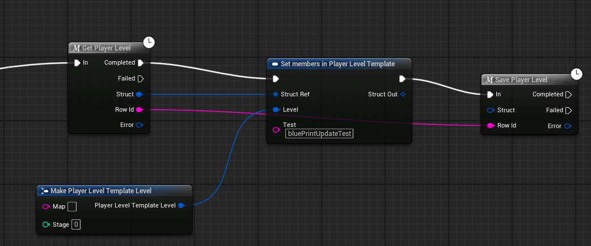

# Game commands

Commands are the only way to change a player's data: the server validates the write against the
template and answers with the whole updated row, which the SDK writes back into the player cache — so a
read straight after a write sees the new values.

## Blueprint

The nodes live under *Flock | Commands*: `Flock Update Player Data`, `Flock Update Player Data Field`,
`Flock Unlock Achievement`, `Flock Add Game Funds`, and `Flock Flush Pending Commands`.

Build the values to write by dragging off the **Data** pin and chaining *Set Command Int / Float / String
/ Bool / String Array*. Each of those takes **and returns** an `FFlockCommandData`, so they chain left to
right. There is also *Set Command Json* for a nested shape, and *Command Value (…)* makers for the
single-field node.



`Flock Get Pending Command Count` drives a "syncing…" indicator while offline writes wait to replay.

If you have run a schema sync, the generated `Save <Template>` macro replaces this whole chain with one
node — see [Code generation](codegen.md).

## C++

Everything lives on the command provider:

```cpp
UFlockSubsystem* Sdk = UFlockSubsystem::Get(this);

Sdk->GetCommandProvider()->UpdatePlayerData(RowId,
    FFlockCommandData().Set(TEXT("coins"), 250).Set(TEXT("prestige"), true),
    [](TFlockResult<FFlockPlayerData> Result) { /* Result.Value is the updated row */ });

// The wallet row is resolved from the "currency"-tagged template — no id to look up first.
Sdk->GetCommandProvider()->AddGameFunds(TEXT("coins"), 250, OnComplete);
```

## Things worth knowing


- **Field names go out verbatim — use the template's names, not the ones you read back.** The SDK never
  case-transforms a write key, because only you know what the backend stores. Note that a *read* is not
  symmetric with a write here: a row's flattened data exposes `game_currencies` as `GameCurrencies` (so a
  struct can bind to it), and the dotted getters accept either spelling. A write has no such tolerance —
  the server matches the template exactly, so writing the name `Get Data Field Names` handed you is
  rejected with `game_command.template_validation_failed`. Write the name as the template declares it.
  (`FFlockPlayerTemplateSchema::SchemaJson` carries the declared names verbatim if you need to look them
  up at runtime; `Flock.SelfTest`'s commands sweep does exactly that.)
- **Values keep their type.** An int stays an int and a bool stays a bool on the wire — the builder is
  not a string map.
- **Data writes queue offline.** An update or achievement unlock made with no connectivity is saved to
  disk, applied optimistically to the cached row, and replayed in order when the connection returns —
  automatically on sign-in, on returning to the foreground, and on reconnect. The queue belongs to the
  player who made the writes and survives quitting the game.
- **Money does not.** `AddGameFunds` fails with a Connection error when the server is unreachable rather
  than queueing, and is never re-sent after an ambiguous failure (a timeout may mean the credit already
  landed). No offline grants, no double credits.
- **A queued write is only discarded when the backend rejects it** — which is a question of *who* said no,
  not which number came back. A permanent 4xx from the server is an answer, so that write is dropped and
  its optimistic value rolled back rather than blocking everything behind it. Everything else keeps the
  whole queue for the next attempt: a temporary failure, an expired session (401 clears when you sign back
  in), a response the SDK cannot parse — a captive-portal login page answering a write with an HTML `200`
  means the server never saw it, and throwing the change away on that would lose work the player did — and
  a **403 with no error code in it**, which is a proxy or network gateway rather than the backend refusing
  the write.
- **A write that never becomes deliverable is dropped after 50 replay attempts.** This is a backstop, not a
  retry budget: a real outage should keep the player's writes, and a flush only happens on sign-in, on
  returning to the foreground, and on reconnect, so 50 of them span a long time. It exists so that no
  failure the SDK cannot classify is able to hold the queue — and every write behind it — indefinitely. The
  count is persisted with the entry, so it spans relaunches the way the queue itself does.

---

[← Back to the README](../README.md)
