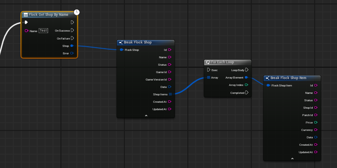
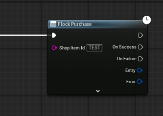

# Shop

A **shop** is a named collection of **shop items**. An item has a price, a currency, and free-form
`data` / `stats` the game reads however it likes. Buying one credits it to a player's **inventory**.

Catalog reads are cached and served from the offline snapshot; purchases and inventory never are — see
[Caching and money-safety](#caching-and-money-safety), which is the part of this guide worth reading even
if you skip the rest.

## Blueprint

The nodes live under *Flock | Shop*:

| Node | Returns |
|---|---|
| `Flock Get All Shops` | a page of shops (`Page`, `Limit`) |
| `Flock Get Shop By Id` | one shop |
| `Flock Get Shop By Name` | one shop, found by its dashboard name |
| `Flock Get Shop Item` | one item by its id |
| `Flock Get Shop Items` | every item in a shop (optional `Patch Id`) |
| `Flock Purchase` | the resulting inventory entry |
| `Flock Get Player Inventory` | a page of what a player owns |



**You do not pass a player.** These act for the signed-in player, and the `Player Id` pin is tucked into
each node's advanced section (the little arrow) for the rarer case of reading someone else's inventory.

An item's free-form **Data** and **Stats** pins are `FFlockJsonData` handles, not strings. Read them with
the *Get Json Int / Float / String / Bool / String Array* nodes, which take a dotted path and a fallback —
no JSON parsing node needed.



After a schema sync you can replace the id wiring entirely: the generated `Purchase` macro takes a typed
`FlockShopItemId` dropdown instead. See [Code generation](codegen.md).

## C++

Everything lives on the shop provider:

```cpp
UFlockSubsystem* Sdk = UFlockSubsystem::Get(this);

// Browse.
Sdk->GetShopProvider()->GetByName(TEXT("Starter"),
    [Sdk](TFlockResult<FFlockShop> Shop)
    {
        if (!Shop.bSuccess) { return; }

        for (const FFlockShopItem& Item : Shop.Value.ShopItems)
        {
            int32 Damage = 0;
            Item.Stats.TryGetInt(TEXT("damage"), Damage);   // free-form, read by dotted path
        }
    });

// Buy. An empty player id resolves the signed-in player.
Sdk->GetShopProvider()->Purchase(ItemId, FString(),
    [](TFlockResult<FFlockPlayerInventory> Entry)
    {
        if (!Entry.bSuccess && Entry.Error.Code == EFlockErrorCode::ShopInsufficientFunds)
        {
            // The server declined — show the player, don't retry.
        }
    });

// What they own.
Sdk->GetShopProvider()->GetPlayerInventory(FString(), /*Page*/ 1, /*Limit*/ 100, OnInventory);
```

## Caching and money-safety

- **A purchase is never retried.** It posts non-idempotently, so an ambiguous failure — a timeout, a
  dropped connection — is reported rather than re-sent. A timeout may mean the charge already landed, and
  the SDK will not risk charging twice. Show the failure and let the player decide.
- **A purchase is never queued offline.** Unlike a player-data write, it fails immediately when the server
  is unreachable. There is no offline shopping.
- **Inventory is always fetched fresh.** It is never cached and never snapshotted, because it is what a
  player owns — stale here is worse than a round trip.
- **Catalog reads are cached and snapshot-backed.** Shops and items are memoized in-process and written to
  the offline snapshot, so a returning player with no connection still sees the store. Prices come from
  that snapshot too, so treat a displayed price as advisory until the purchase succeeds — the server is
  the authority.
- **Purchases report themselves to analytics.** Started / Purchased / Failed transactions are dispatched
  alongside the call for revenue metrics. They are fire-and-forget: a failed analytics call never fails a
  purchase, and analytics being disabled simply skips them.
- **`ClearCache()`** drops the in-process caches and the shop snapshot category, so the next read hits the
  backend. C++ only.

## Things worth knowing

- **`Get Shop Items` takes an optional patch id.** Leaving it empty reads the current items; supplying one
  reads the catalog as of that patch, which is how a limited-time or A/B store front is served.
- **Paged reads return a page struct**, not a bare array — `Items`, `Total`, `Page`, `Limit`. Ask for the
  next page by incrementing `Page`; there is no cursor to carry.
- **`data` and `stats` are author data.** The SDK never transforms their keys, so they read back exactly
  as the dashboard declares them.

---

[← Back to the README](../README.md)
