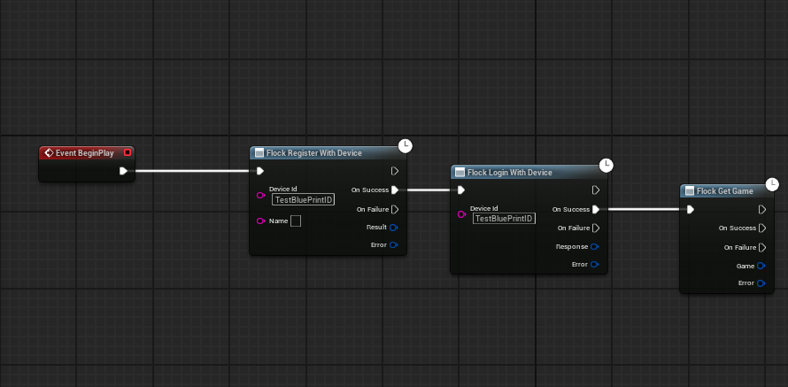

# Flock Unreal SDK

The Flock Unreal SDK provides access to Flock's game backend services from Unreal Engine games.

> **Early release.** Everything below ships today except the asset provider. See [Status](#status).

## Contents

- [Features](#features)
- [Installation](#installation)
- [Requirements](#requirements)
- [Setup](#setup)
  - [Baking the Game Version](#baking-the-game-version)
- [Initialization](#initialization)
  - [Automatic](#automatic-default)
  - [Manual](#manual)
- [Quick Start](#quick-start)
- [Accessing the SDK](#accessing-the-sdk)
- [Feature guides](#feature-guides)
- [Error handling](#error-handling)
- [Offline caching](#offline-caching)
- [Testing](#testing)
- [Status](#status)

## Features

- **Global accessor** — `UFlockSubsystem`, a `UGameInstanceSubsystem` ready when the game starts and the
  entry point to the SDK.
- **Hands-off startup** — the SDK auto-initializes from your project settings at launch, or you drive
  init yourself.
- **Offline, synchronous init** — the Game Version ID is resolved at edit time and baked into
  `DefaultGame.ini`; runtime init makes no network call.
- **Automatic version baking** — the Game Version ID resolves and bakes itself when you edit your
  settings (or on editor load if unresolved), with a Play-In-Editor setup guard and a packaging build
  guard. No manual step required; a manual **Resolve Game Version** action is still available.
- **HTTP transport** — an instance HTTP client over the engine HTTP module with automatic retry
  (exponential backoff + jitter, `Retry-After` aware) and a callback + result surface (no C++
  exceptions). JSON is (de)serialized to/from your `USTRUCT` models, unwrapping the backend envelope.
- **Typed errors** — every failure is an `FFlockError` with a typed `EFlockErrorType`, the server's
  `EFlockErrorCode`, and the server's human-readable message (`ServerMessage`) — Blueprint-ready,
  with `UFlockErrorLibrary` exposing display text and coded-error group checks to Blueprint.
- **SDK events** — a single hub (`GetEvents()`) for lifecycle, auth, session, and consent events,
  Blueprint-assignable, with auto-init-safe `CallOrRegister` entry points for the init events.
- **Authentication** — email/device/Google/Apple/Steam login and registration, encrypted token
  persistence, automatic session restore, silent token refresh, and the account flows.
- **Analytics** — a diagnostic log API, session tracking, automatic exception capture, an offline
  queue that survives crashes, consent gating, and next-launch crash reporting.
- **Game config** — fetch configs and patches (by id, by name, by tag, by version tag) and resolve a
  config's effective values (patch for this game version, else its base data). Read values in Blueprint
  with typed accessors by dotted path, or bind them to your `USTRUCT` in C++. Plus the game record and
  version info.
- **Shop** — browse shops and items (all shops, by id or name, a single item, a shop's items), buy an
  item for a player, and read a player's inventory. Catalog reads are cached and snapshot-backed; a
  purchase is money-safe (never retried on an ambiguous failure, never queued) and reports the
  transaction for revenue metrics; inventory is always fetched fresh.
- **Player data & templates** — read a player's saved data (by row id, a page of rows, or the signed-in
  player's row for a template by the template's id or tag), browse the player templates that define those
  records, and check a player's ban status. A player's rows are paginated once and cached; templates are
  cached and snapshot-backed.
- **Game commands** — the server-validated way to change a player's data: write a set of fields or a
  single field onto a data row, unlock an achievement, or add funds to a wallet. Every command returns
  the updated row and writes it back into the player cache. Data writes queue offline and replay
  automatically; funds never do — a grant fails rather than being queued, and is never re-sent after an
  ambiguous failure.
- **Code generation** — one menu click turns your backend's templates, configs, and shops into typed
  structs, enums, and one-node reads, writes, and purchases. Blueprint by default, with no toolchain and
  no compile step; switch the target to emit a generated C++ module instead.
- **Offline snapshot cache** — successful config, game, shop-catalog, and player-template reads are cached
  to disk, scoped to the game version, and served when the network is down; toggleable in settings.
- **Pluggable logger** — route SDK breadcrumbs and errors into your own telemetry or on-screen debugger.
- **Blueprint-friendly** — every provider call is a self-contained async node, and the fire-and-forget
  calls plus auth/session state are one-node too (no "Get Flock Subsystem" needed). Events, error types,
  and structured data all read from Blueprint.

## Installation

**Download: [github.com/QwackStack/FlockUnrealSdk/releases](https://github.com/QwackStack/FlockUnrealSdk/releases)**

Get the plugin into your project one of two ways:

- **Extract the release zip** into your project's `Plugins/` folder. The archive nests everything under
  `FlockUnrealSdk/`, so you end up with `YourProject/Plugins/FlockUnrealSdk/` and nothing to rename.
- **Clone the repo** into the same place, if you want to track it with git:
  `git clone https://github.com/QwackStack/FlockUnrealSdk.git YourProject/Plugins/FlockUnrealSdk`

Then, either way:

1. Right-click your `.uproject` → **Generate Visual Studio project files**.
2. Rebuild the project. The plugin's `Flock` runtime and `FlockEditor` editor modules compile with it.
3. The plugin is enabled by default — verify under **Edit → Plugins → Online Platform → Flock SDK**.

Each release is built from the tagged source, so it contains no compiled binaries: you build it once with
your project, against your engine version and toolchain.

## Requirements

- **Unreal Engine 5.5.**
- A C++ project (the SDK is a code plugin). Blueprint-only projects need the C++ toolchain installed to
  compile the plugin.

## Setup

Open **Project Settings → Plugins → Flock SDK Settings**. Required values:

- **API URL** — Flock API endpoint (default: `https://api-flock.qwacks.com`)
- **API Key** — your Flock API key
- **Game Name** — your game's name from the Flock dashboard
- **Game Version** — your game version name; the matching ID is resolved at edit time and baked in, so
  init makes no network call

Values are written to your project's `DefaultGame.ini`.

### Baking the Game Version

The Game Version ID bakes **automatically**: it resolves whenever you fill in or change a resolve input
(**API URL** / **API Key** / **Game Version**), and once on editor startup if the project has a version
name but no baked ID. It writes the ID into `DefaultGame.ini` (the read-only **Game Version ID** field on
the settings panel), so runtime init never contacts the server. You can also force a resolve any time with
**Tools → Flock → Resolve Game Version**.

## Initialization

### Automatic (default)

With the settings above filled in, **Auto-Initialize On Load** is on by default, so `UFlockSubsystem`
initializes itself when the game starts. Nothing to call — just use the subsystem when you need it.

```cpp
// React to init (optional). Auto-init completes before BeginPlay, so use CallOrRegister —
// it fires immediately if the SDK is already initialized, otherwise when init succeeds:
if (UFlockSubsystem* Flock = UFlockSubsystem::Get(this))
{
    FFlockInitializedCallback OnReady;
    OnReady.BindDynamic(this, &AMyActor::HandleFlockReady); // HandleFlockReady must be a UFUNCTION()
    Flock->GetEvents()->CallOrRegister_OnInitialized(OnReady);
}
```

To drive init yourself — e.g. to defer past a splash screen or EULA — turn **Auto-Initialize On Load**
off (Flock SDK Settings → Initialization) and call one of the manual entry points below.

> **Init is fail-safe.** A bad config or an unresolved Game Version leaves the SDK uninitialized and
> logs the reason (it never crashes startup). Guard with `IsInitialized()`, read
> `GetInitializationError()`, or handle `GetEvents()->OnInitializationFailed`.

### Manual

```cpp
UFlockSubsystem* Flock = GetGameInstance()->GetSubsystem<UFlockSubsystem>();

// From project settings:
Flock->InitializeFromSettings();

// ...or from an explicit config (e.g. tests / custom startup):
FFlockInitConfig Config;
Config.ApiUrl = TEXT("https://api-flock.qwacks.com");
Config.ApiKey = TEXT("...");
Config.GameId = TEXT("my-game");
Config.GameVersion = TEXT("1.0.0");
Config.GameVersionId = TEXT("...");   // baked at edit time
Flock->InitializeWithConfig(Config);
```

## Quick Start

The shortest path from zero to reading data — the SDK initializes itself, so sign a player in and read
something back. Every feature follows the same shape; see the [Feature guides](#feature-guides).

**C++**

```cpp
// 1. With Auto-Initialize On Load on (the default), the SDK is already running by BeginPlay.
UFlockSubsystem* Sdk = UFlockSubsystem::Get(this);

// 2. Sign the player in.
Sdk->GetAuthProvider()->LoginWithDevice(DeviceId,
    [Sdk](TFlockResult<FFlockPlayerLoginResponse> Login)
    {
        if (!Login.bSuccess) { return; }

        // 3. Read something back.
        Sdk->GetGameProvider()->GetGame(
            [](TFlockResult<FFlockGameSchema> Game)
            {
                UE_LOG(LogTemp, Log, TEXT("Playing %s"), *Game.Value.Name);
            });
    });
```

**Blueprint** — drop `Flock Login With Device` into a graph and wire its success pin to `Flock Get Game`.
Neither node needs a Target pin; both resolve the SDK from the graph they are in.



## Accessing the SDK

**C++:**

```cpp
#include "FlockSubsystem.h"

if (UFlockSubsystem* Flock = UFlockSubsystem::Get(WorldContextObject))
{
    if (Flock->IsInitialized())
    {
        const FString VersionedUrl = Flock->GetVersionedApiUrl(); // e.g. https://.../v1
    }
}
```

`UFlockSubsystem::Get(WorldContext)` is a convenience wrapper over
`GetGameInstance()->GetSubsystem<UFlockSubsystem>()`; either works.

**Blueprint: you usually don't need to get the subsystem at all.** Every node resolves the SDK from the
graph it's called in, so a call is one node with no Target pin to wire:

- **Provider calls** are async nodes with success/failure pins — `Flock Login With Email`,
  `Flock Get Config By Name`, `Flock Get Shop Items`, `Flock Get My Data By Tag`, `Flock Purchase`, … .
  Each fires exactly one pin, and fails with a Validation error if the SDK isn't initialized.
- **Fire-and-forget calls and state reads** are plain nodes — `Flock Log Event`, `Flock Record Screen
  View`, `Flock Set Analytics Consent`, `Flock Is Authenticated`, `Flock Get Player Id`, `Flock Logout`,
  `Flock Is Initialized`, `Flock Get Events`, … . All are safe no-ops (or return defaults) before init,
  so they never need an "is ready" guard.

Search the node menu for **Flock** to see the full set. The subsystem is still there via **Get Flock
Subsystem** if you prefer a Target pin, and you *do* need it for one-time setup — `Initialize From
Settings`, `Initialize With Config`, and `Shutdown Sdk`, which are deliberately not duplicated as
free-floating nodes.

## Feature guides

Per-feature usage lives in its own guide. Each separates the **Blueprint** surface from the **C++** one,
so you can read only the half you work in.

| Guide | Covers |
|-------|--------|
| [Authentication](Documentation/authentication.md) | Login/register for every provider, logout, token refresh and revocation, password reset, email verification |
| [Game config & metadata](Documentation/game-config.md) | Resolving effective values, configs and patches, feature flags, game/version records |
| [Player data & templates](Documentation/player-data.md) | Reads by id/template/tag, templates, pagination, bans |
| [Game commands](Documentation/game-commands.md) | Updating a row, achievements, funds, the offline queue and its money-safety rules |
| [Shop](Documentation/shop.md) | Shops and items, purchase and its money-safety contract, player inventory |
| [Code generation](Documentation/codegen.md) | Sync Schemas, generated structs/enums/one-node macros, the C++ target, Clean |
| [Analytics](Documentation/analytics.md) | Sessions, logs and events, transactions, consent, crash detection |
| [SDK events](Documentation/events.md) | The event hub — lifecycle, auth, and session events |
| [Logging & debugging](Documentation/logging.md) | Debug logs, the network call trace, the self-test |

## Error handling

Every call answers with a `TFlockResult<T>` rather than throwing — Unreal builds with exceptions off.
Check `bSuccess`, then read `Value` or `Error`:

```cpp
if (!Result.bSuccess && Result.Error.Code == EFlockErrorCode::ShopInsufficientFunds)
{
    // The server declined — not enough funds.
}
```

`FFlockError` carries a typed `EFlockErrorType` (Auth, Validation, Network, Connection, Timeout,
Serialization, Cancelled), the server's `EFlockErrorCode`, and the server's own human-readable
`ServerMessage`. `UFlockErrorLibrary` exposes display text and coded-error group checks to Blueprint, so
a graph can branch on a failure without matching strings.

## Offline caching

Successful config, game, shop-catalog, and player-template reads are snapshotted to disk, scoped to the
game version, and served when the server is unreachable — the server is always tried first, and there are
no TTLs. Toggle it with **Enable Offline Cache** in settings.

Bans, player inventory, and purchases are never cached: they are security or money state that can change
server-side at any moment. Player data rows are cached per player and dropped on sign-out.

## Testing

Automation tests live beside each feature and are grouped under the `Flock.` prefix. Run them from
**Tools → Session Frontend → Automation** (filter `Flock.`), or headless:

```
UnrealEditor-Cmd.exe <YourProject>.uproject -ExecCmds="Automation RunTests Flock." -unattended -nullrhi -log
```

## Status

Shipping: the boot/init foundation, the HTTP transport, automatic version baking, the SDK event hub,
player authentication, analytics, game config (with the offline snapshot cache), the shop
(catalog, purchase, inventory), player data & templates (with bans), game commands (with the
offline queue), and typed code generation for Blueprint or C++. Not yet wired:

- **Remaining feature provider.** Assets build on the same HTTP layer and land in a later release — the
  transport, retry, typed error model, and endpoint registry they need are already in place.
- **Analytics gameplay events.** This release ships the diagnostic log API (event/error/exception) and
  purchase/transaction reporting (with the shop); custom gameplay event tracking arrives later.
- **A few Blueprint gaps.** Config *patch* reads (all patches, by id, by config) and configs by version
  tag are C++-only for now — in Blueprint, `Flock Resolve Config Data` already returns the patched-or-base
  values, which is what most graphs want. Provider cache clearing is also C++-only.

See [CHANGELOG.md](CHANGELOG.md) for the version history.

## License

MIT — see [LICENSE.md](LICENSE.md).

## Support

- Documentation: https://docs.qwacks.com/sdk/unreal
- Email: support@qwacks.com
